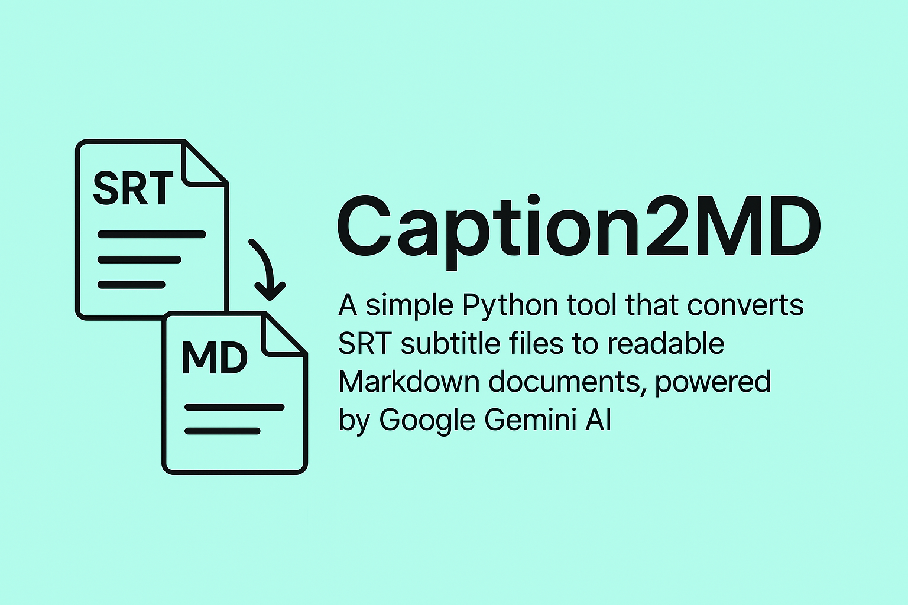

# Caption2MD

A simple Python tool that converts SRT subtitle files to readable Markdown documents, powered by Google Gemini AI.



## Features

- Leverages Google's Gemini AI model to process subtitle content
- Converts SRT subtitle files to clean Markdown format
- Removes timestamps while preserving subtitle text
- Intelligently formats AI-generated captions for better readability
- Batch processes multiple SRT files in a directory
- Creates a flag file to indicate when processing is complete

## AI Integration

Caption2MD utilizes Google's Gemini AI model to enhance the conversion process from SRT to Markdown. This integration allows for:

- Improved text formatting and organization
- Better handling of AI-generated captions
- Enhanced readability of the final Markdown document

## Installation

```bash
# Clone the repository
git clone https://github.com/kirklin/caption2md.git
cd caption2md

# Install dependencies
pip install pysrt
```

## Usage

1. Place your AI-generated SRT files (such as those from Google Gemini) in the `srt` directory
2. Run the script:

```bash
python main.py
```

3. The converted Markdown files will be saved in the same directory as the SRT files

## Customization

You can change the input directory by modifying the `srt_directory` variable in `main.py`:

```python
# Change to your SRT files directory
srt_directory = './your_directory'
```

## Requirements

- Python 3.10+
- pysrt

## License

MIT

## Author

[Kirk Lin](https://github.com/kirklin) 
